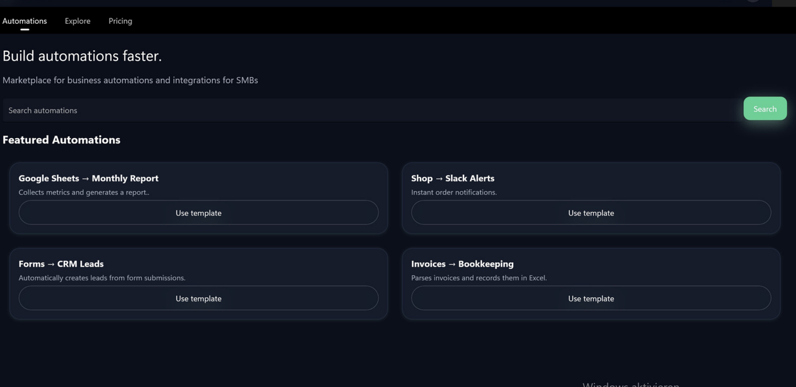
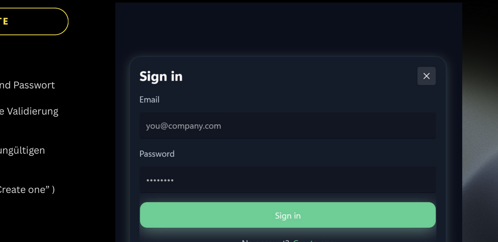
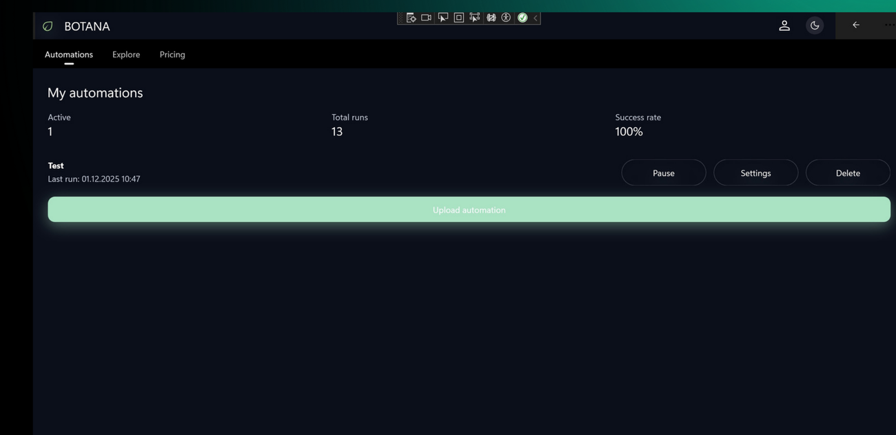
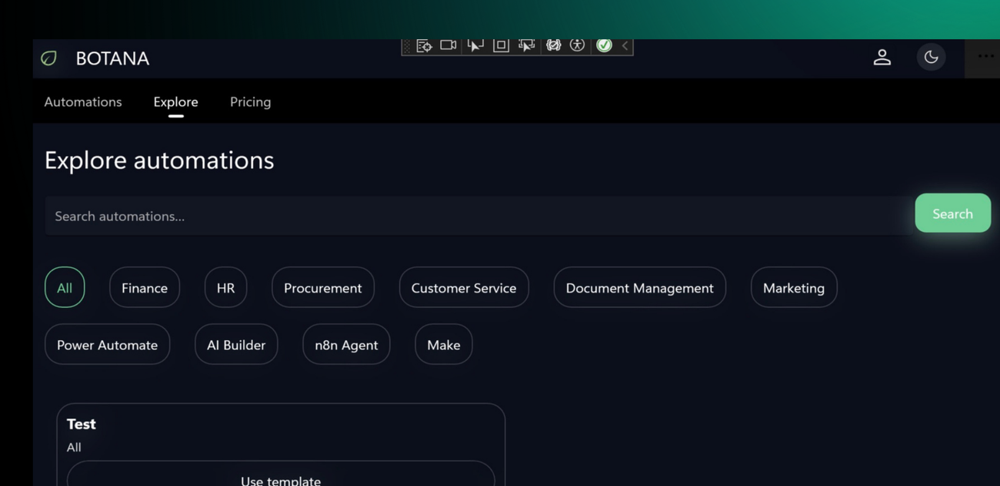
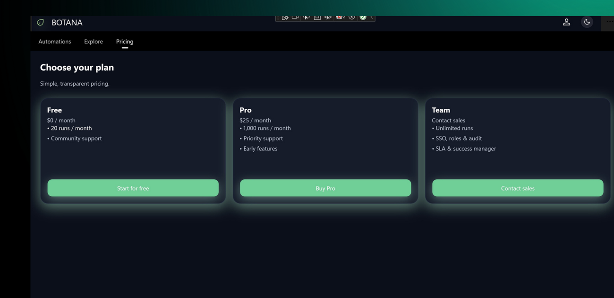

# Botana

**Cross-Platform-Marktplatz für Workflow-Automatisierungen** – entwickelt mit .NET MAUI, C#, SQLite und MVVM.

Botana ist eine Desktop-Anwendung, über die kleine und mittlere Unternehmen (KMU) fertige Automatisierungs-Workflows finden, anpassen, teilen und wiederverwenden können – ohne eigene IT-Abteilung. Statt jeden Prozess manuell aufzusetzen, wählen Nutzer Vorlagen aus einem Katalog und setzen sie direkt ein.

-----

## Screenshots

### Startansicht – Automations-Marktplatz

### Login & Authentifizierung

### My Automations – eigene Workflows verwalten

### Explore – Katalog mit Kategoriefilter

### Pricing – Tarifmodelle

-----

## Funktionen

- **Marktplatz-Übersicht** mit Suche und Filterung nach Kategorien und Stichworten
- **Workflow-Detailansicht** mit Beschreibung, Parametern und „Use Template”-Funktion
- **Upload eigener Workflows** mit Speicherung in SQLite
- **Benutzerverwaltung** mit Registrierung, Login und Session-Verwaltung über Preferences
- **Rollenbasierte Navigation** (Admin / User) mit eigenem Admin-Bereich
- **My Automations**: Übersicht eigener Workflows inkl. Kennzahlen (Total Runs, Last Run, Success Rate) und Steuerung (Pause, Settings, Delete)
- **Profil & Einstellungen** mit Benachrichtigungen und DSGVO-Hinweis zur lokalen Datenverarbeitung
- **Theme-Umschaltung** (Light / Dark Mode), appweit und persistent
- **Pricing-Modelle** (Free / Pro / Team) als Konzept im MVP

-----

## Technologie-Stack

|Bereich                |Technologie                                                           |
|-----------------------|----------------------------------------------------------------------|
|Sprache                |C#                                                                    |
|UI-Framework           |.NET MAUI (Desktop, perspektivisch macOS)                             |
|Architektur            |MVVM (Model-View-ViewModel)                                           |
|Datenhaltung           |SQLite                                                                |
|Sitzung / Einstellungen|.NET MAUI Preferences                                                 |
|API-Ausblick           |REST/JSON (IApiClient-Interface, HttpClient-Wrapper, DTO – konzipiert)|

-----

## Architektur

Die Anwendung ist nach dem **MVVM-Muster** strukturiert und in vier Schichten gegliedert:

- **View** – XAML-Seiten (Login, Register, Explore, My Automations, Settings, Admin)
- **ViewModel** – Geschäftslogik und Bindung an die Views
- **Model / Core** – Datenmodelle (User, Workflow, UserWorkflow)
- **Data** – Zugriff auf die SQLite-Datenbank

### Datenmodell (SQLite)

- **Users** – Benutzerkonten (Login, Rollen, Admin-Rechte)
- **Workflows** – Metadaten der Automations-Templates (Titel, Kategorie, Beschreibung)
- **UserWorkflows** – Verknüpfungstabelle zwischen User und Workflows (Favorit, Status, letzte Nutzung)

-----

## Projektkontext

Botana ist als **MVP** im Rahmen eines IT-Projekts (Fachinformatiker Anwendungsentwicklung) entstanden. Ziel war eine Eigenentwicklung („Make”) als kostengünstige Alternative zu externen Lizenzlösungen („Buy”) zur Prozessautomatisierung in KMU und Bildungsträgern.

**Bewusst nicht im MVP enthalten:** Zahlungsabwicklung, komplexes Rollen-/Rechtemodell, produktive REST-API (nur als Mock konzipiert), Community-Funktionen wie Bewertungen.

-----

## Ausblick

- Produktive REST-API statt Mock
- Ausbau des Workflow-Katalogs
- Integration per Webhooks
- Erweiterung auf macOS und Web

-----

*Entwickelt von Anastasia Stein.*